# Лабораторно-практична робота №1
**на тему:** "Проходження інтерактивного курсу «Git How To» "

**Мета:** Ознайомитися з базовими командами та принципами роботи з системою контролю версій Git шляхом проходження інтерактивного навчального курсу. Сформувати практичні навички використання Git у консольному середовищі для виконання основних операцій.

*Пройдені частини: Частина 1 + Частина 2*

## Частина 1.
**Крок 1.** Фінальні приготування до повної готовності до роботи з Git

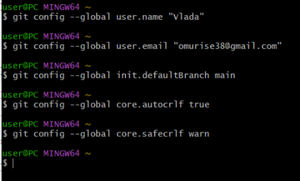

---

**Крок 2.** Створення проєкту

Створено сторінку "Hello, World" та створено репозиторій

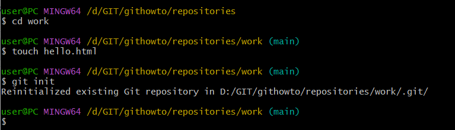

Додано сторінку у репозиторій

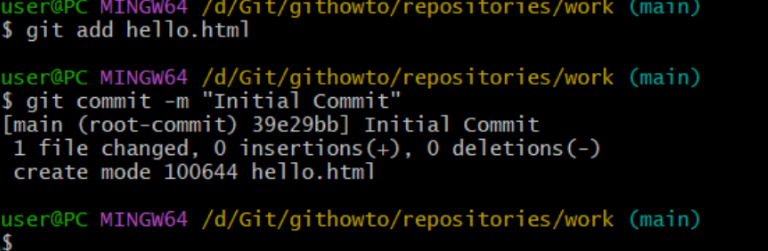

Файл 'hello.html'

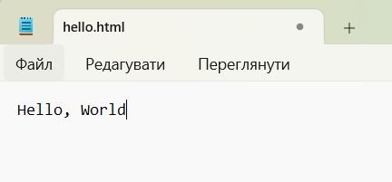

---

**Крок 3.** Перевірка стану

Використано команду `git status`, щоб дізнатися поточний стан репозиторію

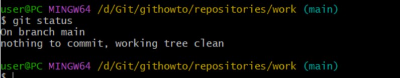

---

**Крок 4.** Внесення змін

Змінено сторінку "Hello, World" 

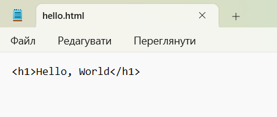

Перевірено стан робочої директорії

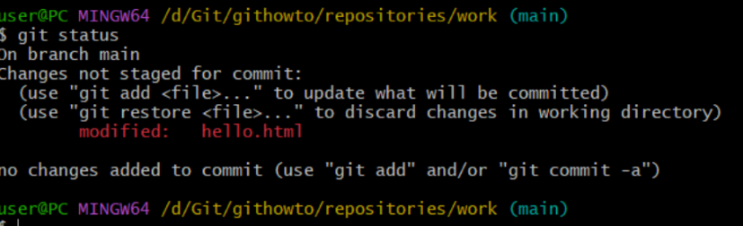

---

**Крок 5-6.** Індексація змін

Дана команда Git, щоб було проіндексовано зміни та перевірено стан для наступних комітів

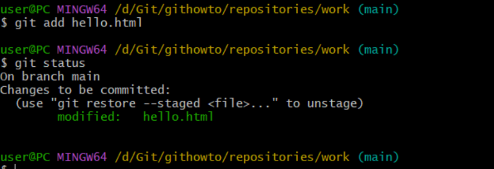

---

**Крок 7.** Коміт змін

Зроблено коміт і перевірено стан. У редакторі в першому рядку введено коментар `Added h1 tag`. Наприкінці ще раз перевірено стан

---

**Крок 8.** Зміни, а не файли

Перша зміна: додані стандартні теги сторінок

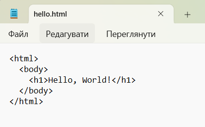

Додано зміни в індекс Git

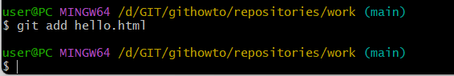

Друга зміна: Додано заголовок HTML

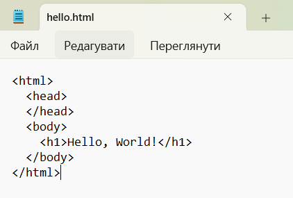

Перевірено поточний статус

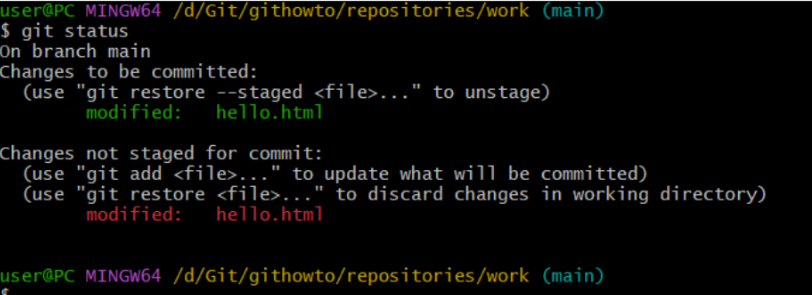

Зроблено коміт проіндексованих змін, а потім ще раз перевірено стан

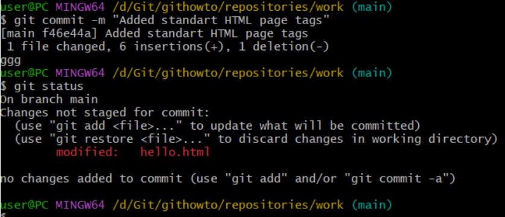

Додано другу зміну в індекс, і потім перевірено стан за допомогою команд `git status`.

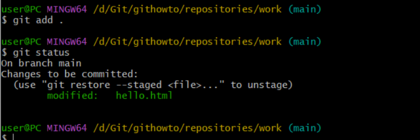

Зроблено коміт другої зміни

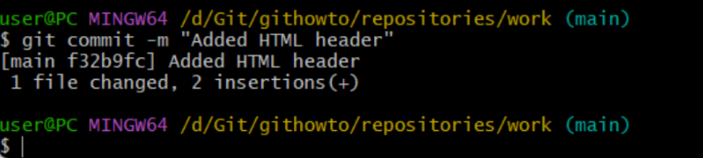

---

**Крок 9.** Історія проєкту

Отримано список зроблених змін - функція команди `git log`. Отримано список усіх чотирьох комітів, котрі було створено в репозиторії.

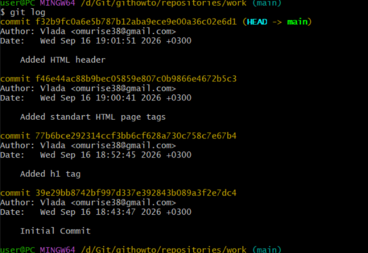

Однорядковий формат

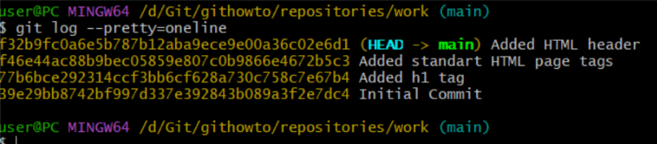

Переглянуто історії за допомогою величезної кількості варіантів перегляду історії 

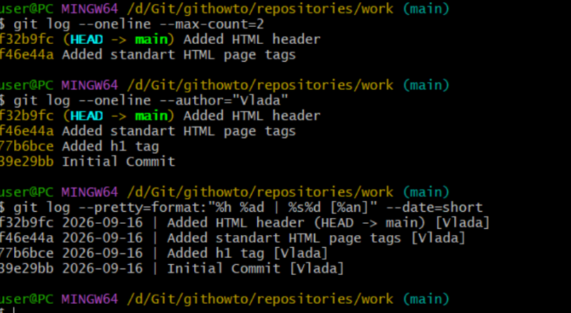

---

**Крок 10.** Отримання старих версій

Отримано хеші попередніх комітів

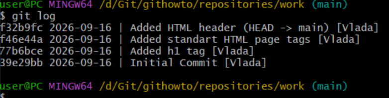

Історія змін та перевірка вмісту файлу 'hello.html'

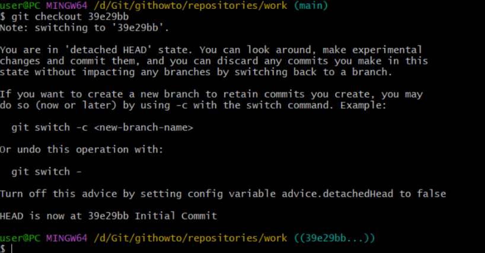

Повернення до старої версії гілки в 'main' за допомогою команди 'switch' та перевірка вмісту файлу 'hello.html'

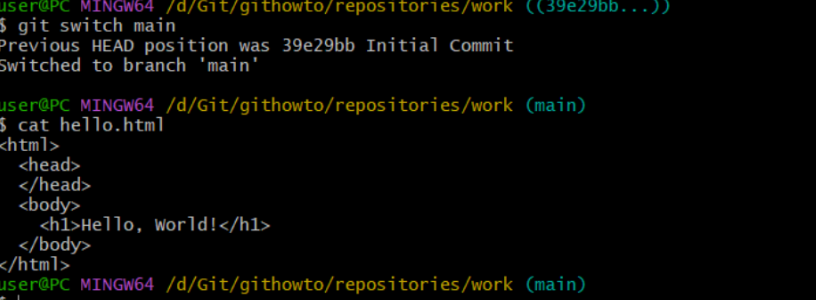

---

**Крок 11.** Створення тегів версій

Створено тег першої версії, позначено версію, що передує поточній назвою 'v1-beta'.

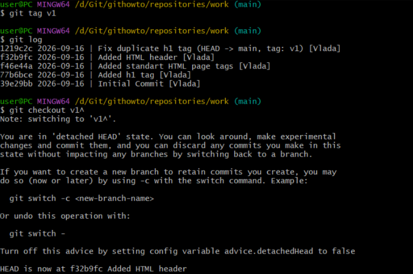

Перевірено вміст файлу hello.html - версія з тегами '<html>' та '<body>', але поки без '<head>'. Зроблено її версією 'v1-beta'

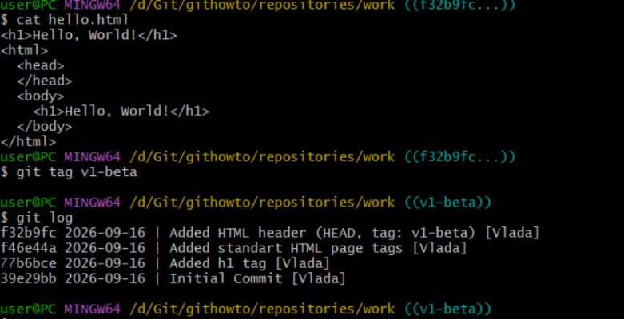

Спроба поперемикатися між двома зазначеними версіями. Переглядів тегів за допомогою команди 'tag'. Та перегляд тегів у логах.

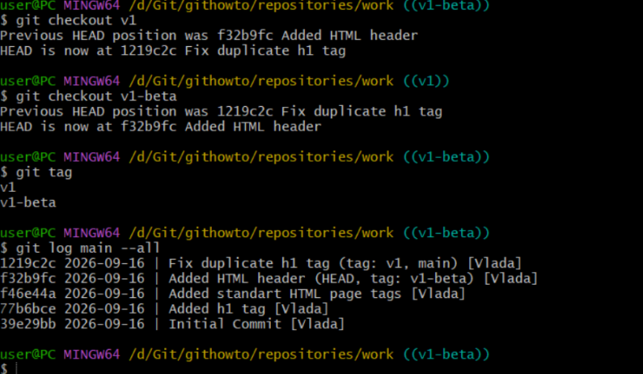

---

**Крок 12.** Скасування локальних змін (до індексації)

Перебування на останньому коміті гілки 'main'. Внесено зміни у файл 'hello.html' у вигляді небажаного коментаря. Перевірено стан робочої директорії за допомогою 'git status'. Скасовано зміни в робочій директорії за допомогою команди 'restore' та переглядаємо вміст файлу 'hello.html'

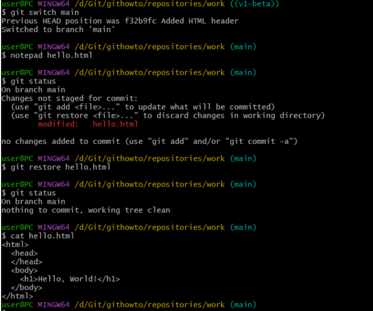

---

**Крок 13.** Скасування проіндексованих змін перед комітом

Внесено зміни у файл 'hello.html' у вигляді небажаного коментаря

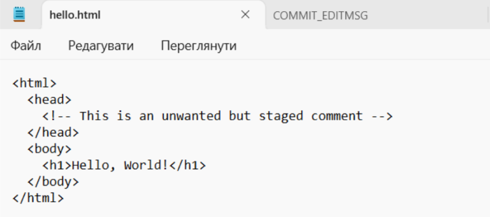

Проіндексовано ці зміни та перевірено стан небажаної зміни. Відновлено індекс за допомогою 'git restore --staged hello.html'. Відновлено файл до стану останнього коміту - робоча директорія знову чиста.

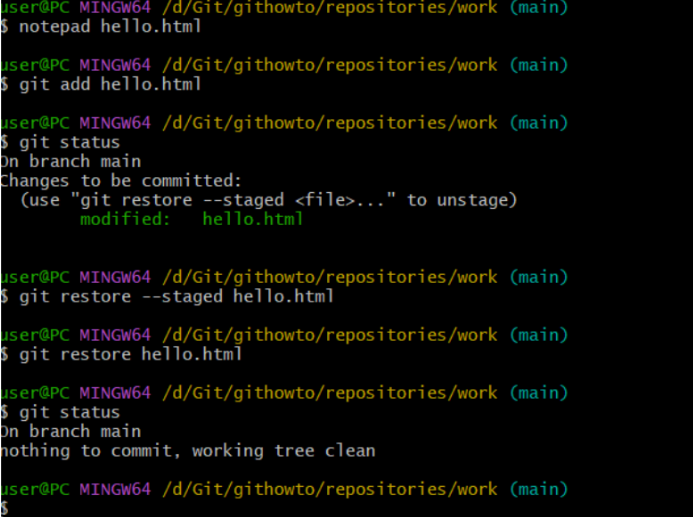

---

**Крок 14.** Скасування комітів

Змінено файл 'hello.html'

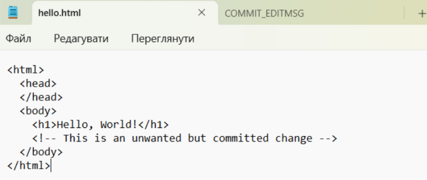

Виконано 'git add hello.html' та 'git commit -m "Oops, we didn't want this commit"'. Зроблено коміт, що видаляє зміни, збережені небажаним комітом. Та перевірено лог.

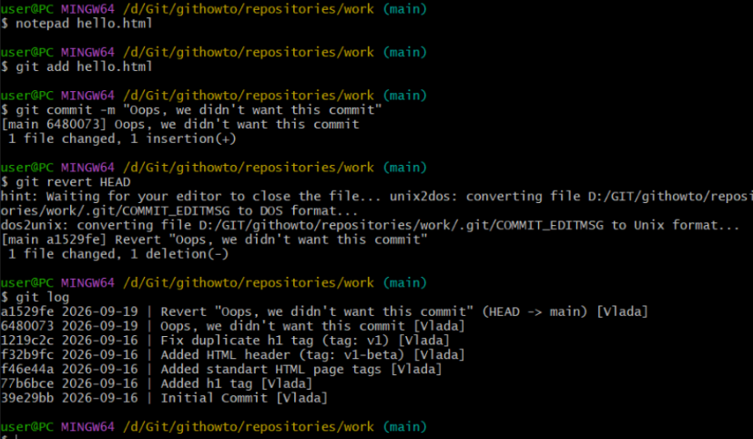

---

**Крок 15.** Видалення комітів з гілки ('revert')

Перевірено історію комітів. Позначено останній коміт тегом, щоб потім можна було його знайти. Відкіт до коміту, що передує до 'opps'. Бачимо всі коміти за допомогою 'git log --all'

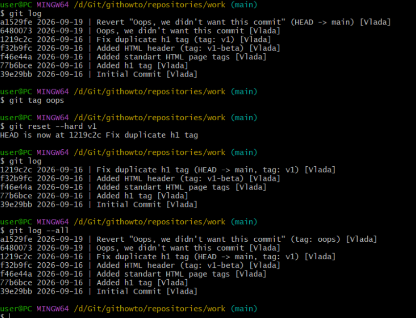

---

**Крок 16.** Видалення тегу 'oops'.

Видалено тег 'oops' - це дасть змогу внутрішньому механізму Git прибрати залишкові коміти, на які тепер не посилаються жодні гілки або теги.

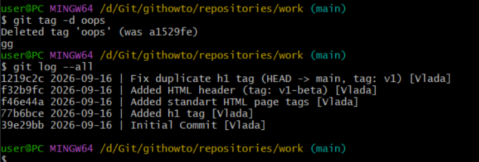

---

**Крок 17.** Внесення змін до комітів

Додано в сторінку коментар автора, включивши в неї email

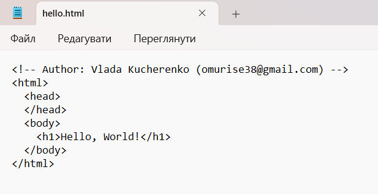

Змінено попередній коміт, включивши в нього адресу електронної пошти. Перегляд історії.

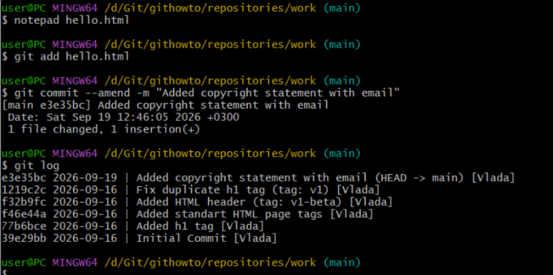

---

**Крок 18.** Створення гілки

Створено гілку під назвою 'style'. Виконано 'git add hello.html' та 'git commit -m "Included stylesheet into hello.html'"

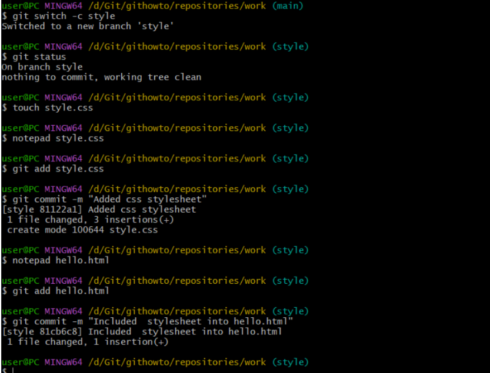

Додано файл стилів 'style.css'.

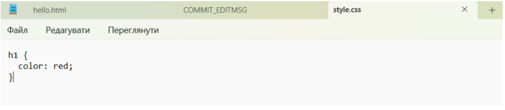

Змінено 'hello.html' для того, щоб використовувати 'style.css'

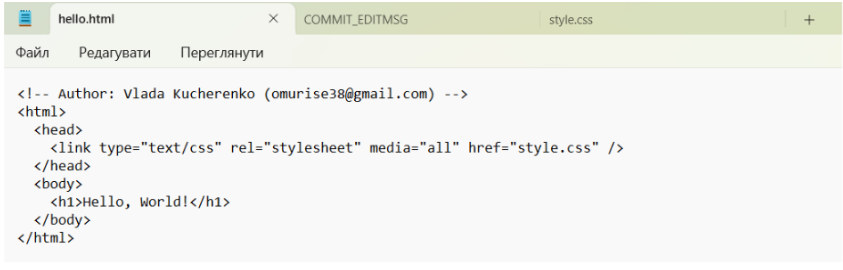

---

Крок 19. Перемикання гілок

