# Лабораторно-практична робота №1
**на тему:** "Проходження інтерактивного курсу «Git How To» "

**Мета:** Ознайомитися з базовими командами та принципами роботи з системою контролю версій Git шляхом проходження інтерактивного навчального курсу. Сформувати практичні навички використання Git у консольному середовищі для виконання основних операцій.

*Пройдені частини: Частина 1 + Частина 2*

## Частина 1 Основи GIT
**Крок 1.** Фінальні приготування до повної готовності до роботи з Git

---

**Крок 2.** Створення проєкту

Створено сторінку "Hello, World" та створено репозиторій

Додано сторінку у репозиторій

Файл 'hello.html'

---

**Крок 3.** Перевірка стану

Використано команду `git status`, щоб дізнатися поточний стан репозиторію

---

**Крок 4.** Внесення змін

Змінено сторінку "Hello, World" 

Перевірено стан робочої директорії

---

**Крок 5-6.** Індексація змін

Дана команда Git, щоб було проіндексовано зміни та перевірено стан для наступних комітів

---

**Крок 7.** Коміт змін

Зроблено коміт і перевірено стан. У редакторі в першому рядку введено коментар `Added h1 tag`. Наприкінці ще раз перевірено стан

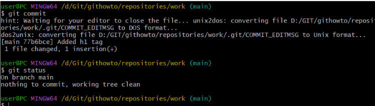

---

**Крок 8.** Зміни, а не файли

Перша зміна: додані стандартні теги сторінок

Додано зміни в індекс Git

Друга зміна: Додано заголовок HTML

Перевірено поточний статус

Зроблено коміт проіндексованих змін, а потім ще раз перевірено стан

Додано другу зміну в індекс, і потім перевірено стан за допомогою команд `git status`.

Зроблено коміт другої зміни

---

**Крок 9.** Історія проєкту

Отримано список зроблених змін - функція команди `git log`. Отримано список усіх чотирьох комітів, котрі було створено в репозиторії.

Однорядковий формат

Переглянуто історії за допомогою величезної кількості варіантів перегляду історії 

---

**Крок 10.** Отримання старих версій

Отримано хеші попередніх комітів

Історія змін та перевірка вмісту файлу `hello.html`

Повернення до старої версії гілки в `main` за допомогою команди `switch` та перевірка вмісту файлу `hello.html`

---

**Крок 11.** Створення тегів версій

Створено тег першої версії, позначено версію, що передує поточній назвою `v1-beta`.

Перевірено вміст файлу `hello.html` - версія з тегами `<html>` та `<body>`, але поки без `<head>`. Зроблено її версією `v1-beta`

Спроба поперемикатися між двома зазначеними версіями. Переглядів тегів за допомогою команди `tag`. Та перегляд тегів у логах.

---

**Крок 12.** Скасування локальних змін (до індексації)

Перебування на останньому коміті гілки `main`. Внесено зміни у файл `hello.html` у вигляді небажаного коментаря. Перевірено стан робочої директорії за допомогою `git status`. Скасовано зміни в робочій директорії за допомогою команди `restore` та переглядаємо вміст файлу `hello.html`

---

**Крок 13.** Скасування проіндексованих змін перед комітом

Внесено зміни у файл `hello.html` у вигляді небажаного коментаря

Проіндексовано ці зміни та перевірено стан небажаної зміни. Відновлено індекс за допомогою `git restore --staged hello.html`. Відновлено файл до стану останнього коміту - робоча директорія знову чиста.

---

**Крок 14.** Скасування комітів

Змінено файл `hello.html`

Виконано `git add hello.html` та `git commit -m "Oops, we didn't want this commit"`. Зроблено коміт, що видаляє зміни, збережені небажаним комітом. Та перевірено лог.

---

**Крок 15.** Видалення комітів з гілки (`revert`)

Перевірено історію комітів. Позначено останній коміт тегом, щоб потім можна було його знайти. Відкіт до коміту, що передує до `opps`. Бачимо всі коміти за допомогою `git log --all`

---

**Крок 16.** Видалення тегу `oops`.

Видалено тег 'oops' - це дасть змогу внутрішньому механізму Git прибрати залишкові коміти, на які тепер не посилаються жодні гілки або теги.

---

**Крок 17.** Внесення змін до комітів

Додано в сторінку коментар автора, включивши в неї email

Змінено попередній коміт, включивши в нього адресу електронної пошти. Перегляд історії.

---

**Крок 18.** Створення гілки

Створено гілку під назвою `style`. Виконано `git add hello.html` та `git commit -m "Included stylesheet into hello.html`"

Додано файл стилів `style.css`.

Змінено `hello.html` для того, щоб використовувати `style.css`

---

**Крок 19.** Перемикання гілок

Виконано `git log --all`. Використано команду `git switch` для перемикання між гілками. Повернення до гілки `style`

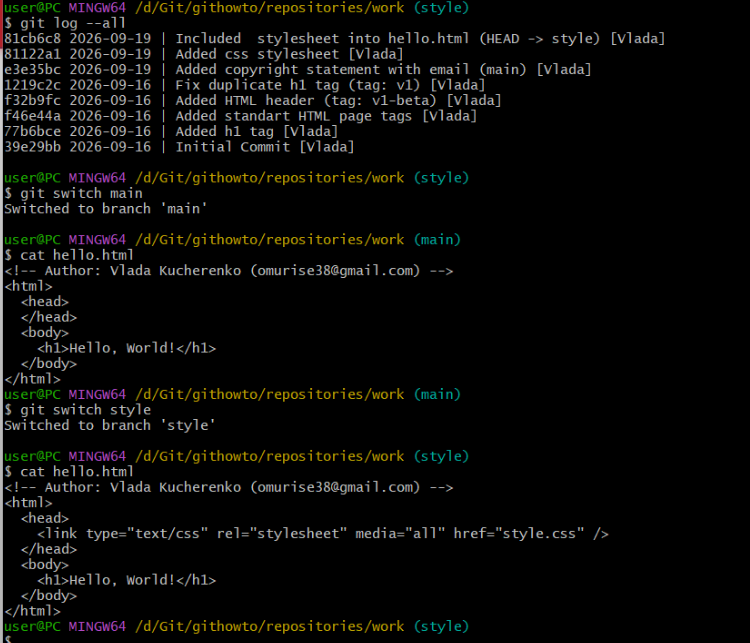

---

**Крок 20.** Переміщення файлів

Перегляд історії змін `hello.html` перед тим, як його перейменувати. Перегляд різниці між версіями певного файлу. Перейменовування `hello.html` за допомогою стандарної команди `mv`.

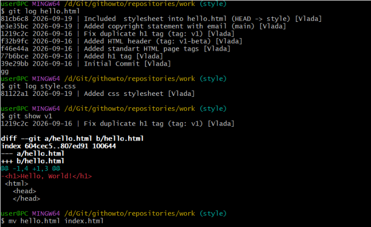

Перевірка git status. Потрібно повідомити Git, що файл саме перейменували, щойно буде додано його до індексу: `git add .` `git status`

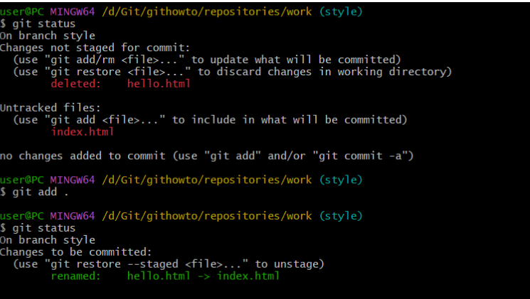

Безпечно переміщено файл `style.css` до директорії `css` за допомогою безпечної команди `git mv`.

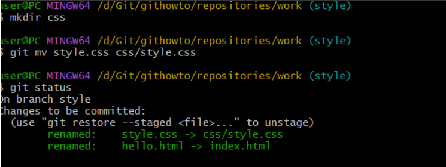

Зміни закомічено і перевірено історію змін у файлі `css/styles.css`. Додано опцію `--follow`, щоб побачити історію файлу до того, як він був переміщений. Запущено обидва варіанти команди, щоб побачити різницю.

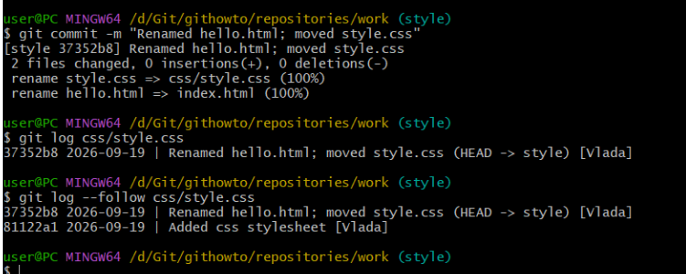

---

**Крок 21.** Зміни в гілці `main`

Створено файл `README`. Він буде пояснювати, про що наш проєкт.

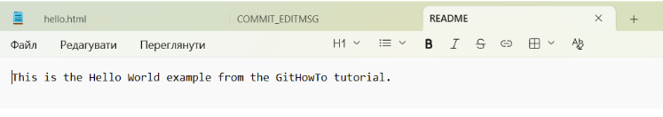

Закомічено файл `README` у гілку `main`

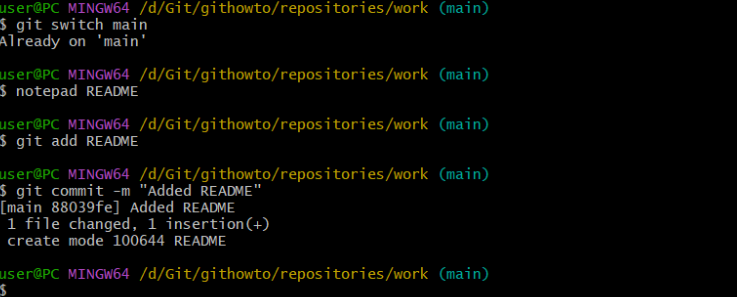

---

**Крок 22.** Перегляд розбіжних гілок

Тепер у репозиторії є дві гілки, що розходяться. Використано команду `git log --all --graph`, щоб переглянути гілки і те, як вони розходяться.

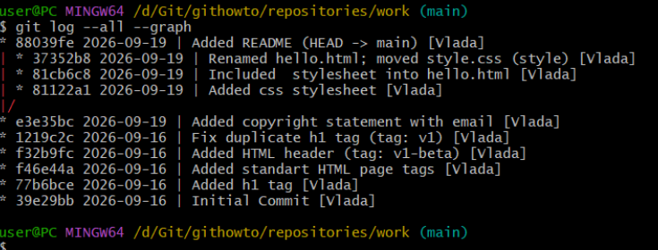

---

**Крок 23.** Злиття

Злиття двох відмінних гілок для перенесення змін в одну гілку.

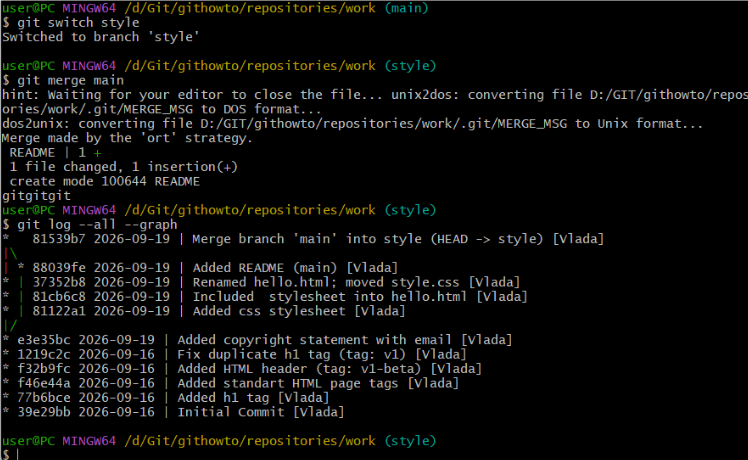
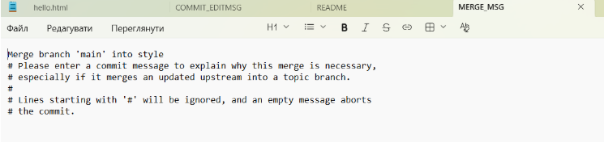

---

**Крок 24.** Створення конфлікту

Повернення до гілки `main` і внесення змін

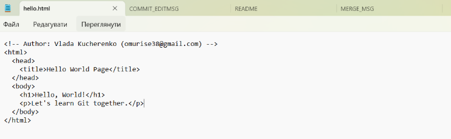

Виконано `git add hello.html`, `git commit -m "Added meta title"`. Перегляд гілок `git log --all --graph`. Після коміту «Added README» гілка `main` була об'єднана з гілкою `style`, але зараз в `main` є додатковий коміт, що не був злитий із `style`.

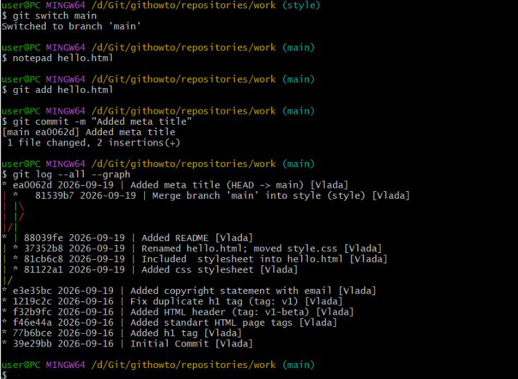

---

**Крок 25-26.** Вирішення конфлікту

Злиття main до гілки `style`. Скасування злиття

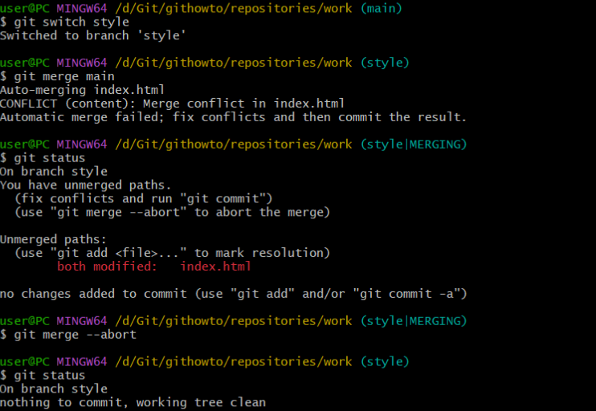

Файл `index.html`

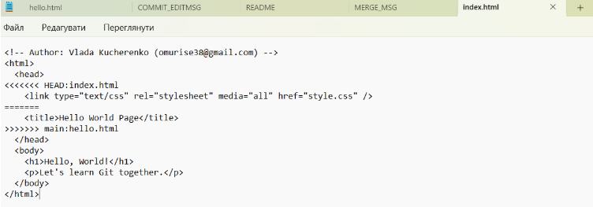

Рішення конфлікту. Зроблено коміт з розв'язаним конфліктом. 

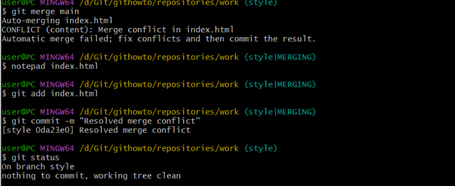

`git log --all --graph`

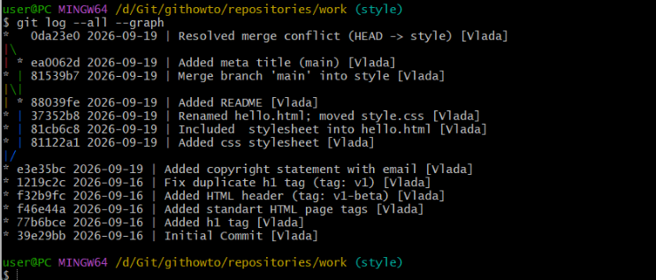

---

**Крок 27.** Відкочування гілки `style`

Відкочування гілки `style`. Виконання `git reset --hard HEAD~2`. Перевірка гілки

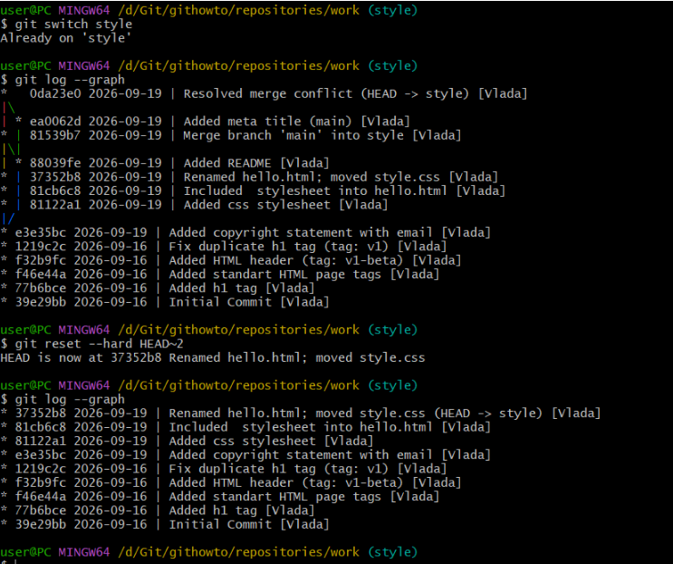

---

**Крок 28.** Перебазування

Перебазування гілки `style` на `main`

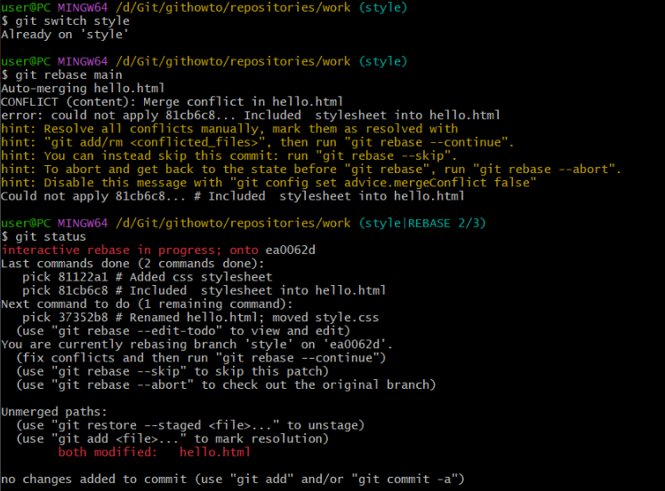

Файл `index.html`

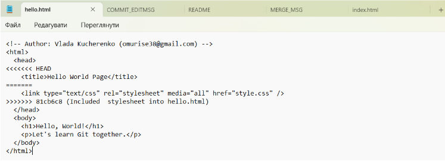

Розв'язання конфлікту. Редагування файлу `hello.html`

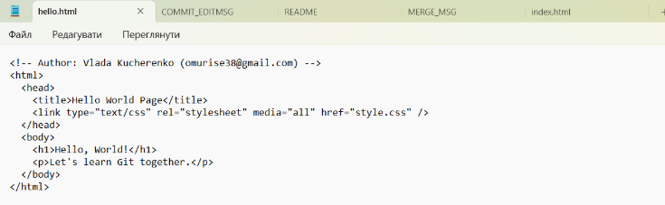

Виконано `git add .` та `git rebase --continue`

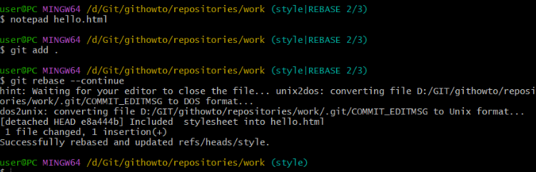

Виконано `git status` та `git log --all --graph`

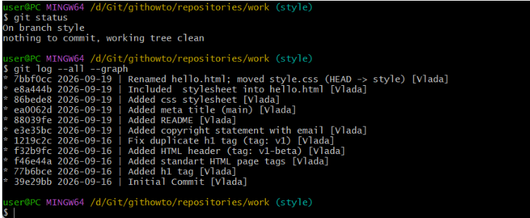

---

**Крок 29.** Злиття в гілку main

Злиття `style` в `main` і перегляд логів

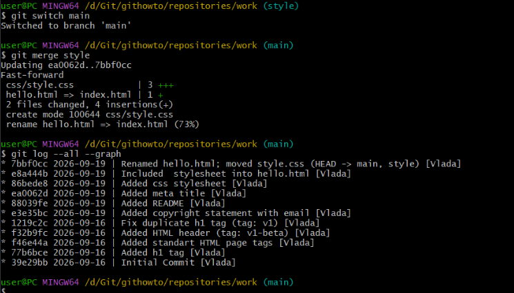

---

## Частина 2 Декілька репозиторіїв
**Крок 30.** Клонування репозиторіїв

Перехід в директорію `repositories` та створення клону репозиторію `work`

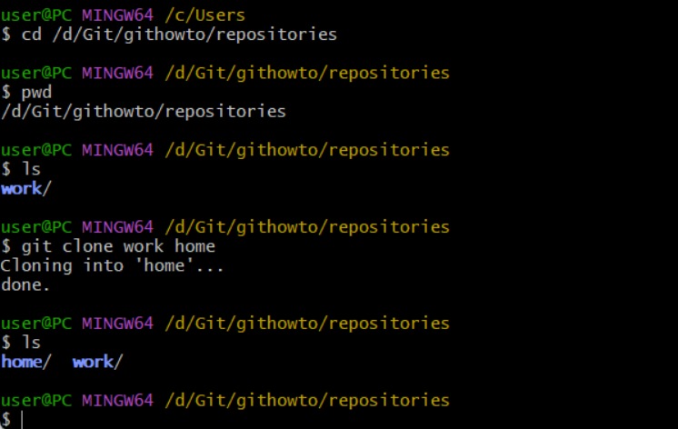

---

**Крок 31.** Перегляд клонованого репозиторію

Бачимо список всіх файлів на верхньому рівні оригінального репозиторія (`README`, `index.html` і `css`). Перегляд історії репозиторію за допомогою  `git log --all`

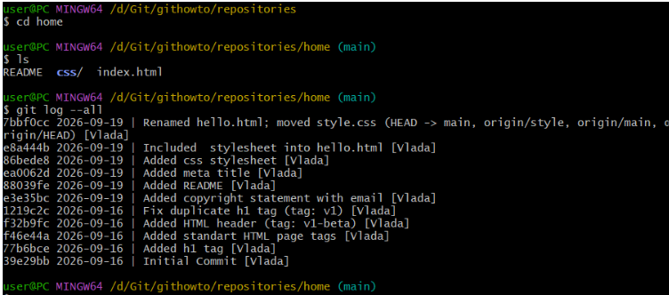

---

**Крок 32.** Що таке `origin`?

Дізнаємося про імена віддалених репозиторіїв та бачимо, що  клонований репозиторій знає про ім'я за замовчуванням віддаленого репозиторія. Отримуємо більш детальну інформацію про ім'я за замовчуванням:

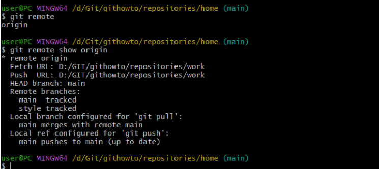

---

**Крок 33.** Віддалені гілки

Бачимо гілки, доступні в нашому клонованому репозиторії. Для того, щоб побачити всі гілки, виконано
`git branch -a``

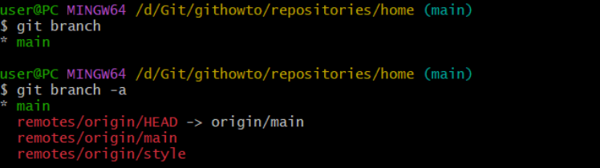

---

**Крок 34.** Зміна оригінального репозиторію

Внесено зміни у файл `README`

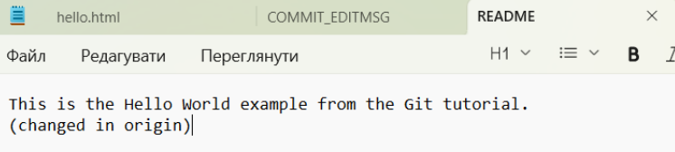

Внесено зміни в оригінальний репозиторій `work`. Додано зміну `README` і зроблено коміт

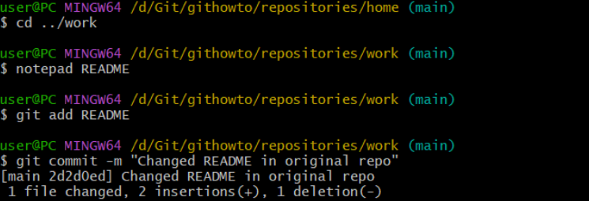

---

**Крок 35.** Підтягування змін

Виконано `cd ../home`, `git fetch`, `git log --all`. Знаходимося в репозиторії `home`. Перевірка `README` (клонований файл `README` не змінився)

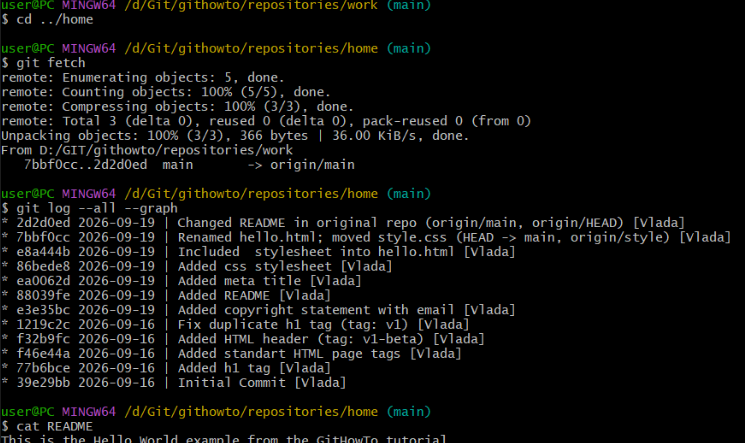

---

**Крок 36.** Злиття підтягнутих змін

Злиття підтягнутих змін в локальну гілку `main`, ще раз перевірено файл `README`. Виконання команди `pull`

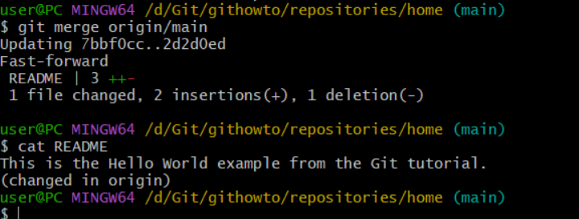

---

**Крок 37.** Додавання гілки відстеження

Додавання локальної гілки, котра відстежує віддалену гілку

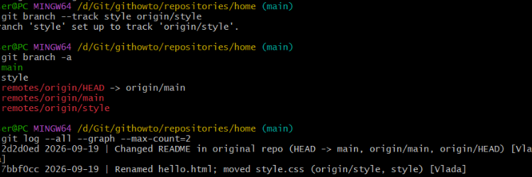

---

**Крок 38.** Чисті репозиторії

Створення чистого репозиторію

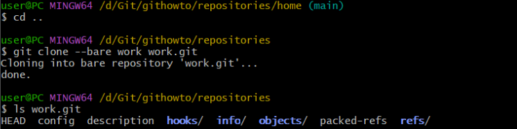

---

**Крок 39.** Додавання віддаленого репозиторію

Додавання репозиторію `work.git` до нашого оригінального репозиторію

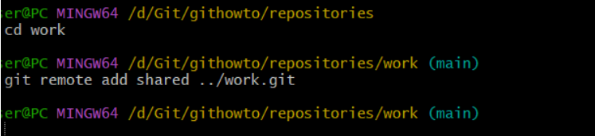

---

**Крок 40.** Відправка змін

Редагування `README` та коміт змін

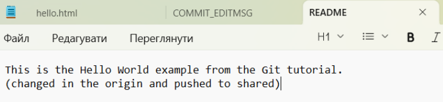

Відправка надісланих змін до спільного репозиторію

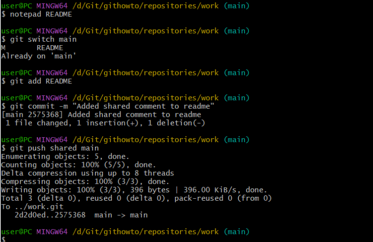

---

**Крок 41.** Підтягування спільних змін

Перемикаання в репозиторій `home` і пітягнення змін, щойно відправлених в спільний репозиторій

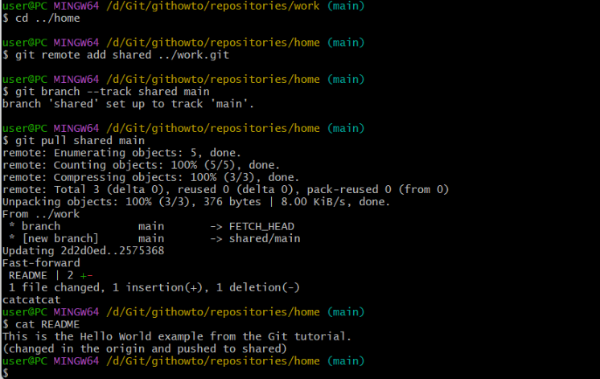

---

